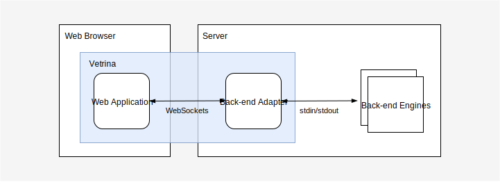

## Vetrina

### Overview

Vetrina is a modern web-based front-end for interactive command line tools,
consisting of a diagram editor and a command window. It connects to
server-side tools (_backend engines_) via
[WebSockets](https://en.m.wikipedia.org/wiki/WebSocket) and allows users to
interact with them through web browsers.

Vetrina makes it very easy to convert basic command line tools in any language
into full-fledged visual experiences and expose them to users on the Internet.

[Live Demo](https://tuura.org/vetrina/?demo/graph)

Vetrina consists of two parts: a web application and a back-end adapter.

The web application is an Angular-based interactive diagram editor with
built-in command window that converts user interactions into JSON objects and
sends them through a WebSocket connection to the back-end adapter. The latter
maintains the server-side end of the WebSocket connection, relaying received
JSON objects to a back-end engine and sending engine replies back to the web
application. Communication between the adapter and engine are done purely
using input/output streams, making it very simple to develop engines in any
language (including Bash, see [this example](py2/engine_hello.sh)).

### Documentation

- [Setup](doc/setup.md#setup)
    - [Web Application](doc/setup.md#web-application)
    - [Back-end Engine](doc/setup.md#back-end-engine)
    - [Connectivity](doc/setup.md#connectivity)
- [Protocol](doc/protocol.md)
    - [Request Object Format](doc/protocol.md#request-object-format)
    - [Response Object Format](doc/protocol.md#response-object-format)
    - [Response Payload](doc/protocol.md#response-payload)
- [Viewer State](doc/viewer-state.md)
    - [Module Objects](doc/viewer-state.md#module-objects)
    - [Connection Objects](doc/viewer-state.md#connection-objects)
- [Developer's Guide](doc/develop.md)
    - [General Organization](doc/develop.md#general-organization)
    - [Dependencies](doc/develop.md#dependencies)
